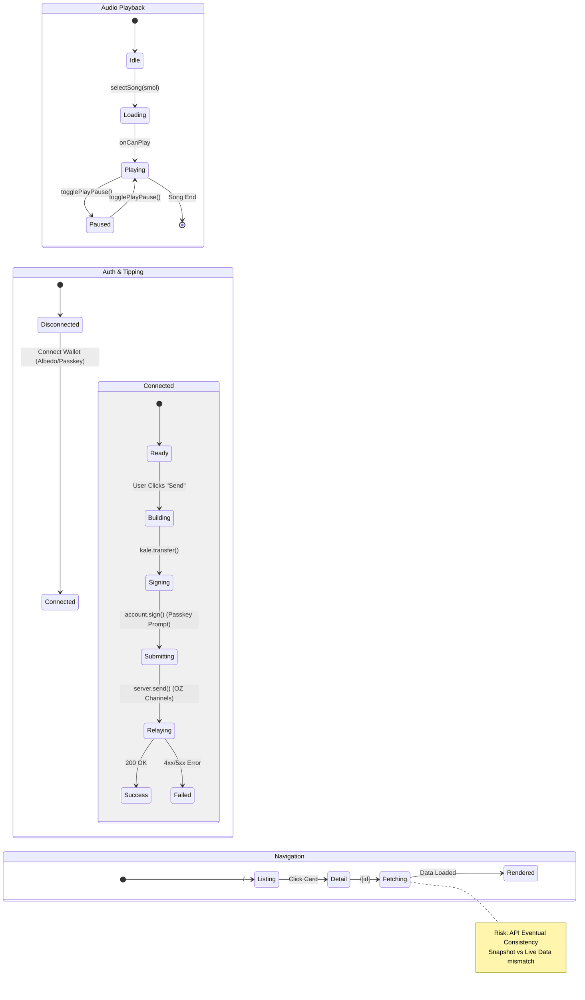

# Smol FE State Machine

## Core Flows

## Critical State Hotspots
1.  **Audio Sync**: `src/stores/audio.svelte.ts` uses `BroadcastChannel` to pause other tabs.
2.  **Passkey Signing**: `src/utils/passkey-kit` relies on `navigator.credentials.get`.
3.  **Relayer**: `src/utils/relayer-adapter.ts` holds the API key and handles nonces.
